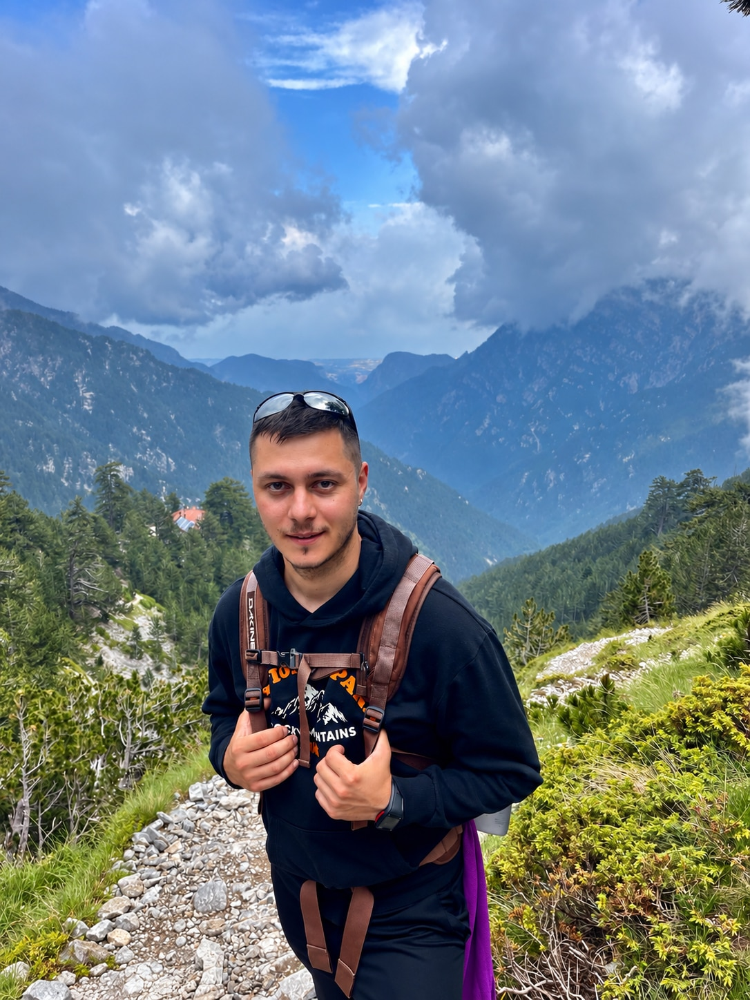

## Who are you and what do you do?

I'm Andrei, a Software Engineering graduate based in Northampton. Before moving into software, I also studied Economics, specialising in Finance and Banking, so my background is a mix of technology, business and finance.

At the moment, I'm trying to make the jump into my first proper software engineering role. My background is a bit unusual because, alongside university, I've also been working as an HGV Class 1 driver.

So right now I'm basically combining a few different worlds — software, logistics and finance — and the projects I'm working on come from problems I've actually seen and experienced myself.

I'm mainly focusing on Python and backend development at the moment, but I'm also really interested in AI, data, cybersecurity, game development and fintech.

I'm also multilingual. Romanian and Russian are my native languages, and I also speak and understand French and Ukrainian.

## What first got you into tech?

My first interest in programming started at school, where I learned Pascal. Later, I got into Pawn, a scripting language based on C, and started experimenting with creating game modes.

C was really my first proper programming language. After that I moved into HTML, CSS and JavaScript and built a few basic websites. At university I worked with C++, C# and Java, and Python came a bit later.

Since then, I've built several academic projects using these languages, and that gradually pushed me further into software development.

## What does your typical working day look like?

It depends a lot on whether I'm driving that day.

Some days I can be up very early and spend most of the day driving a truck. Then when I get some free time, I'll usually do a bit of coding, study something new or work on one of my projects.

At the moment I'm spending most of my learning time on Python, FastAPI, PostgreSQL, REST APIs, testing, Docker and AWS.

I also do coding challenges, work on my GitHub and try to get better at the kind of things that come up in junior software engineering interviews.

So yeah, it can be pretty busy, but the plan is to eventually replace the truck cab with a developer desk.

## What's your setup? Software and hardware. Pictures welcomed!

Nothing too crazy.

For software, I mainly use VS Code and Visual Studio, along with Git, GitHub, Python, FastAPI, PostgreSQL, Docker and pytest.

I also use AI tools quite a lot, including ChatGPT, Codex and Claude, and I'm always exploring other AI tools to see what they can do. I find them really useful for learning, debugging, getting another perspective when I'm stuck, and understanding the flow and logic behind certain problems.

For hardware, I use two main setups.

My MacBook Pro is my portable machine. I used it throughout university and I still use it for coding, learning and working on projects when I'm away from home.

- Apple M2 chip
- 8GB memory
- Around 245GB internal storage
- 1TB external SSD

At home, I have a much more powerful desktop workstation. I mainly use it for gaming, heavier development work and more demanding projects where I need more processing power.

- Intel Core Ultra 9 285K
- NVIDIA RTX 5090 32GB
- 32GB DDR5 RAM
- 2TB WD Blue SN580 NVMe SSD
- MSI PRO Z890-S WiFi motherboard
- Corsair RM1000X 1000W PSU
- Fractal Design Celsius S36 AIO cooler

## What's the last piece of work you feel proud of?

Probably my final-year university project, AILMS — an AI-Enhanced Multi-Role Logistics Management System.

The idea was to build a system for a logistics company where different people like managers, office staff, support teams and drivers could all use the same platform.

It covered things like jobs, fleet management, documents, alerts, reporting, compliance, route planning and permissions for different users.

I'm now working on another project based around truck drivers — working hours, salary tracking, holidays, routes, stops, truck navigation and eventually an AI assistant.

It's basically the kind of app I wish I had while working as a driver.

## What's one thing about your profession you wish more people knew?

For me, one of the most exciting parts is the never-ending learning. It keeps your mind active because there is almost always something new to understand, improve or solve.

I also really like the way engineers think — taking a big problem, breaking it into smaller pieces and working through them one by one. In a way, that's quite similar to how I approach things in everyday life as well.

Another thing I find fascinating is how hardware and software can work together to create something completely new. Technology gives people so many different ways to build, create and express themselves through their work.

## Share with others something worth checking out. Not necessarily tech related. Shameless plugs welcomed.

Yuka - mobile app that lets you scan food and cosmetic barcodes to quickly check how healthy or safe a product is.

MuscleWiki - an app that shows exercises for specific muscles. You select a body part and it gives you suitable exercises with demonstrations.
