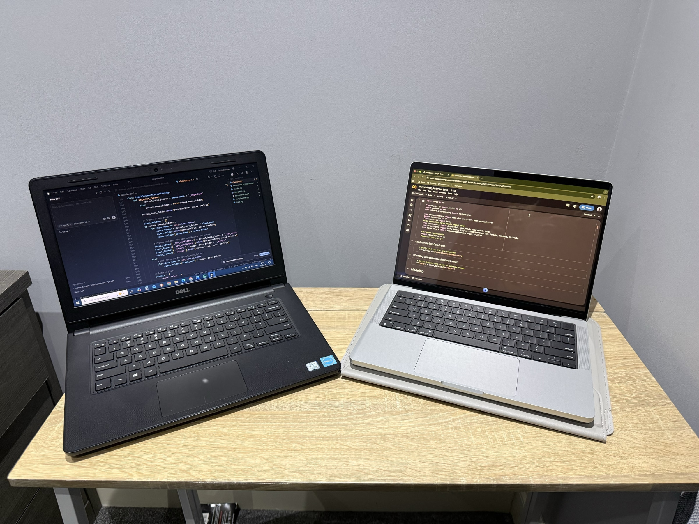

## Who are you and what do you do?

I'm Hla Soe Htay , originally come from Myanmar. I started out in web development and gradually moved into machine learning and AI.

Alongside web development, I also spent over five years working as an IT System Engineer, which gave me solid experience with systems, infrastructure, and how things run in real-world environments. Over time, I became more interested in how systems actually process data and make decisions, not just how they look or function on the surface. That's what pushed me toward machine learning and AI. I recently completed my Master's in Data Analytics, where I worked on a machine learning research project that's now been published. Right now, I'm continuing to build on that research and grow deeper into AI, while working part-time in retail.

Outside of tech, I'm very hands-on. I enjoy DIY mechanical and electrical work, mostly fixing things and giving them a second life instead of throwing them away. I like solving problems, especially when resources are limited, and that mindset carries into my technical work as well. Whether it's code or real-world systems, I enjoy breaking things down and finding practical ways to make them work.

## What first got you into tech?

My journey into tech actually started with a simple question. After finishing secondary school, I was having a casual conversation with my father and one of his friends about what I should study next. At the time, I wanted to become a mechanical engineer because I've always been fascinated by machines and how things work. During the conversation, a simple question was raised: “Why mechanical engineering? Why not computer engineering?”. That question stayed with me.

I started looking into it and doing some research, and I realized how central computers were becoming to almost every industry. It felt like learning computer technology would open up a lot of possibilities. That moment really shifted my direction toward tech. I began my college journey in Singapore studying Information Technology, and later moved to India to continue my studies, where I eventually earned my Bachelor of Technology in Computer Science Engineering.

During that time, I had the opportunity to intern at a software company. I initially started with web design using Adobe Photoshop, then gradually moved into HTML and CSS. At the same time, I was also providing technical support for a School Management ERP system developed by the company. Through that experience, I realized design wasn't really my strength. I was far more interested in the logic and problem-solving side of building software.

Around that time, I came across a quote by Steve Jobs: “Everybody should learn to program a computer, because it teaches you how to think.” That idea stuck with me. Programming wasn't just about writing code; it was about structured thinking and solving problems. From there, I moved into web development using PHP and MySQL, and that's where my journey in tech really began.

## What does your typical working day look like?

Most days usually start with a coffee, turning caffeine into code. I guess I like to begin the morning a bit slower with some yoga, just to get focused before getting into work. After that, I spend a good amount of time on research, especially continuing the work from my published paper and exploring ideas in machine learning.

Some days are a bit different. I head into my part-time retail role, which gives me a chance to interact with people and step away from the screen for a while. It helps me reset from the technical side of things.

So overall, it is a mix. Some days are more focused on research work, and others are more people-facing. I think that balance works well for me.

## What's your setup? Software and hardware. Pictures welcomed!

I like to keep my setup simple and portable so I can work from anywhere. On the hardware side, I mainly use a MacBook Pro 14 with the M4 Pro chip. It's my go-to machine for most of my work because it's powerful but still easy to carry around. Alongside that, I also use a Dell PC when I need a more fixed setup.

For software, I spend a lot of time on Google Colab, especially for research and running experiments since it gives me flexibility without relying too much on local resources. I also use VS Code as my main editor.

Most of my work is in Python, and I use TensorFlow for machine learning projects.

## What's the last piece of work you feel proud of?

The piece of work I feel most proud of is my recent research project on Bitcoin price prediction, where I combined deep learning with social media sentiment and historical data. I worked on collecting and preparing the data, building and testing different models in Python, and comparing their performance. I found that combining sentiment with price data improved predictions compared to traditional approaches.

What I'm most proud of is that the project was published as part of my Master's research. You can [find it here](https://doi.org/10.3390/app15031554). It was a challenging experience, but it gave me a solid understanding of the full machine learning workflow.

## What's one thing about your profession you wish more people knew?

I think a lot of people assume that once you learn a set of skills in tech, you're good to go. But it doesn't really work like that. Things change pretty quickly, and you're always learning something new. Especially with AI and machine learning, the pace has picked up even more. So, it's less about what you already know, and more about how comfortable you are with learning as you go.

## Share with others something worth checking out. Not necessarily tech related. Shameless plugs welcomed.

I'd say learning how to fix things yourself is worth checking out. Even small stuff. Instead of replacing things straight away, I like trying to figure out how they work and see if I can fix them. It usually saves money, and you end up wasting less as well. I'm still learning myself, but I find it really rewarding. If you've got something broken, I'm always up for trying to fix it.
