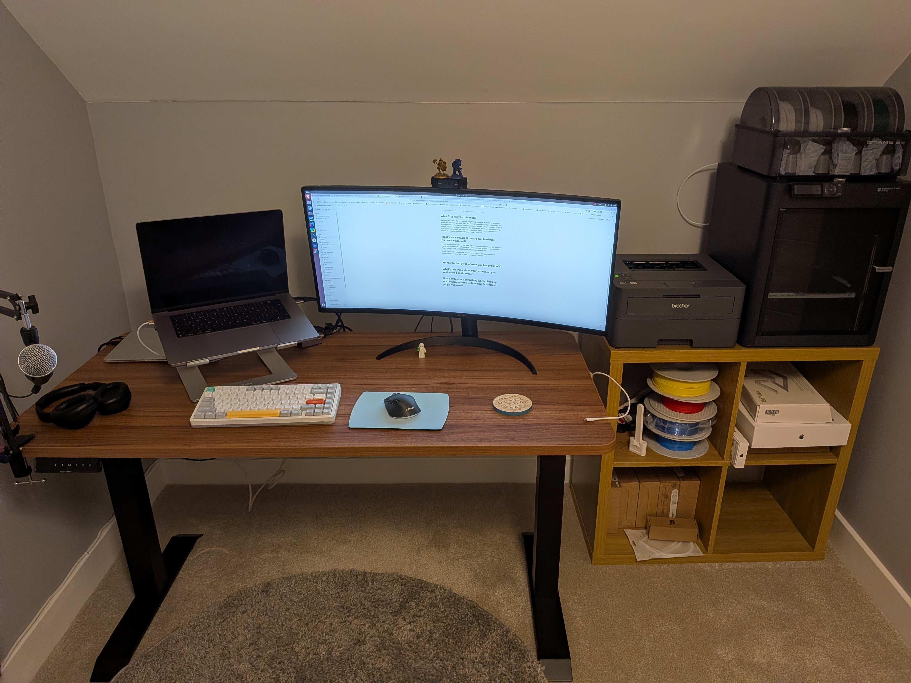

## Who are you and what do you do?

Hi, I’m Jacek, a software engineer at Form3. During my regular 9-to-5, I am mainly responsible for developing and running the backend of our US instant payment system. When I’m not working, I spend time with my wife and two lovely kids. Sometimes I have time to attend to one of my many hobbies: making random websites, home automation, building Lego, 3D printing, and probably a few more I’ve forgotten.

## What first got you into tech?

Originally, I was supposed to be a scientist. A long time ago, I completed my PhD in computational physics, and after working for a few years as a researcher, I realized that coding was the only part I was actually interested in. So, I decided to retrain as a software engineer. I thought, “How hard can it be? I already write code for physics simulations.”

Then I learned that there’s quite a big gap between "executing my own code from top to bottom" and developing, deploying, and running multi-language software for enterprise customers. But I guess I made it in the end!

## What does your typical working day look like?

It's a very typical WFH day, I guess. I wake up at 7:00, have breakfast and coffee with my wife and kids, get them ready, and then drive them to school.

Work starts at 9:00 with a 30-minute chat with my colleagues—sometimes about work, but mostly about how everyone is doing. Then, I am usually off to work on my current tasks, whether that's building new features for our US gateway or doing some cloud networking plumbing. I am blessed to work for a company that understands that big Zoom meetings are rather counterproductive, so I usually don’t have any meetings throughout the day.

I typically take a one-hour lunch break to eat something quickly and go cycling, or read a book if the weather is crap (which is most of the time). I finish around 18:00, eat supper, put the kids to sleep, and that’s my day!

## What's your setup? Software and hardware. Pictures welcomed!

I mostly work from home. I have a dual setup with a work-issued MacBook Pro and an old Framework Laptop 13, both connected to a KVM switch that feeds into an ultrawide monitor. Other fun things I have include a Bambulab P1S 3D printer and a Desktronic standing desk.

On the software side, I am a loyal fan of Ubuntu as my main OS and JetBrains for all my development needs. Since I got a 3D printer, I’ve also started using OpenSCAD quite a bit.

## What's the last piece of work you feel proud of?

My most successful hobby project: hammergen.com. It’s a Warhammer Fantasy character generator built in the days before AI made such things trivial. Originally started in C# with a template engine, it has been redone many times—most recently using Vue with TypeScript. The part I’m actually proud of is that it has about 100 daily users who find it useful.

## What's one thing about your profession you wish more people knew?

Don’t let yourself fall into a routine for too long. Try new things, move to new teams, and change companies. Challenge yourself to do things outside of your comfort zone. Look at what others are doing and how they work, then try it yourself.

## Share with others something worth checking out. Not necessarily tech related. Shameless plugs welcomed.

- [hammergen.com](https://hammergen.com) – For all your Warhammer Fantasy Roleplay character generation needs!
- [jless](https://jless.io/) – A recent discovery, it's a fantastic tool for all the "JSON engineers" out there.
