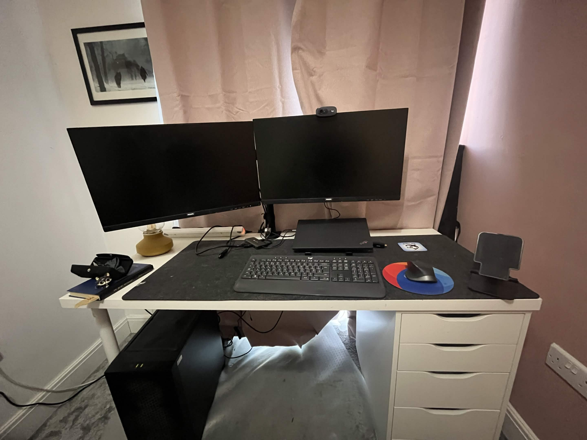

## Who are you and what do you do?

Hi, I'm Jacob and I'm an Application Analyst at Maples Group; an international law firm.

What that actually means is I manage and develop a suite of legal software that our solicitors will use as part of their day-to-day. I primarily automate the production of customised legal precedents used for various Matters (legal cases). This automation allows solicitors to reduce the amount of time they spend filling out legal documents, and reduce the human error that can naturally occur when you have to alter a legal document to suit your particular case type.

I also handle a lot of data aggregation, combining data from various APIs, cloud systems and databases into data readable to technical and non-technical users.

On top of this I also host training sessions for demonstrating how to use the software to business users.

## What first got you into tech?

Getting into tech happened very much by accident for me, I hated programming in secondary school (please don't tell my dad)! I was originally an artist and tried to get into Game Art at university, which I was rejected for and got suggested a Game Design course instead.

I found out during the first year getting into Unreal Engine and learning C++ for that, I actually enjoyed coding, mainly the problem solving element. By year 2 I was the main programmer in group projects I worked on and producing some independent projects.

Unfortunately when I finished university was around 2020, as many will know the game industry was less than stable! Because I had also began learning C# programming I applied locally for other IT jobs and eventually ended up as Developer for the local solicitor Shoosmiths. Ever since I've stayed solidly in the legal sector working for in-house IT.

## What does your typical working day look like?

I wake up around 6am every morning and exercise for about an hour, either at the gym or at home. Between 7:30–8:30am, I do chores and have breakfast, then start work at 9am. I usually get caught up on the day before our 9:30am catch-up; as an international team, the morning chat is useful since we can’t all meet in person.

Depending on the day, I either have a global team catch-up in the afternoon or a more niche discussion regarding ongoing automation projects. Otherwise, I’m nose-deep in legal documents for the rest of the day. Either adapting existing legal precedents for automation, updating them when new regulations come in, or refreshing them to meet current development standards.

On my lunch break I'll try to get out a bit and take the cat on a walk if he's around (I'm not joking).

## What's your setup? Software and hardware. Pictures welcomed!

I'm the least hardware obsessed in my family and get along with office peripherals (lots of Logitech) more than specialist gear. Most of my work is done on a trusty Lenovo Thinkpad T14 Gen 4 which does the job for the sort of software I use at work, primarily legal based document automation and data aggregation software.

Separately I use a CyberPowerPC Luxe Gaming PC with an AMD Ryzen 7 processor for gaming and games development. Unreal Engine 5 is my go-to for games development as whilst I am familiar with C++ programming, I'd rather spend my out of hours work not making my life harder!

## What's the last piece of work you feel proud of?

Unfortunately I can't talk specifics of my jobs work, but recently I started picking up Unreal Engine again to do some learning in my free time. Re-learned that Unreal Engine's preset game templates are a waste of time and within a few hours had a working FPS. Proud to see the skills didn't rust that quickly!

Tragically the bit I was most proud of was getting the vector math working with having sprites rotate appropriately to the player like in old 2.5D FPS games.

## What's one thing about your profession you wish more people knew?

That it exists! There is often a misconception when becoming a Developer for the first time that software engineering is specifically building systems from scratch and digging around in the raw C# code.

Unless the business you're going to work for only uses proprietary systems, a lot will also buy third party systems and adapt them to their business needs. This often conflicts with what is taught in Universities where mostly you will learn core coding competencies. For example whilst being able to write your own reporting system from scratch is very skilful, most of the time it's just easier for the business to just buy some PowerBi licenses and have you learn it. Especially for newer developers I think its worth keeping in mind that whilst traditional software engineering is very much still relevant, it's not all you will work on in a business and not to be disillusioned by not getting to use everything you've learnt.

## Share with others something worth checking out. Not necessarily tech related. Shameless plugs welcomed.

- ["Hyperion" by Dan Simmons](https://www.amazon.co.uk/Hyperion-Cantos-Dan-Simmons/dp/0553283685/ref=asc_df_0553283685) — one of the greatest Sci-if books ever written
- [Tragically boring information on various parts of British culture](https://www.youtube.com/watch?v=Xov8dMP3ocs&t=3s)
- [Very interesting videos (if you like aquariums)](https://www.youtube.com/watch?v=woSFGeMpoxI)
