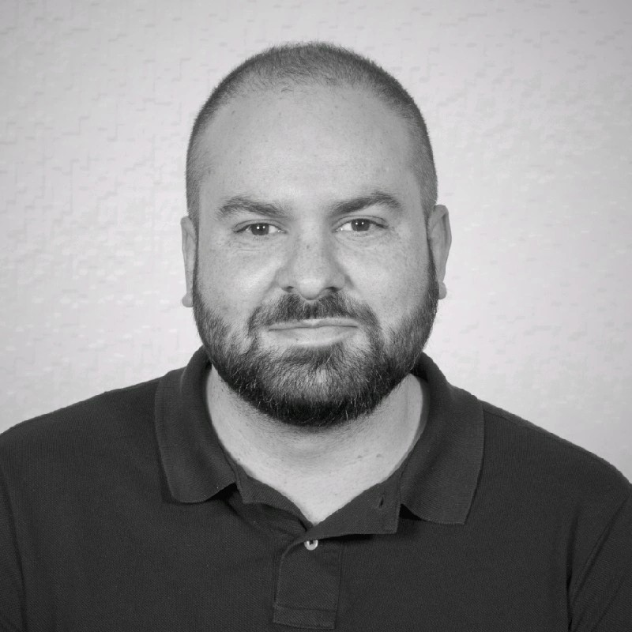
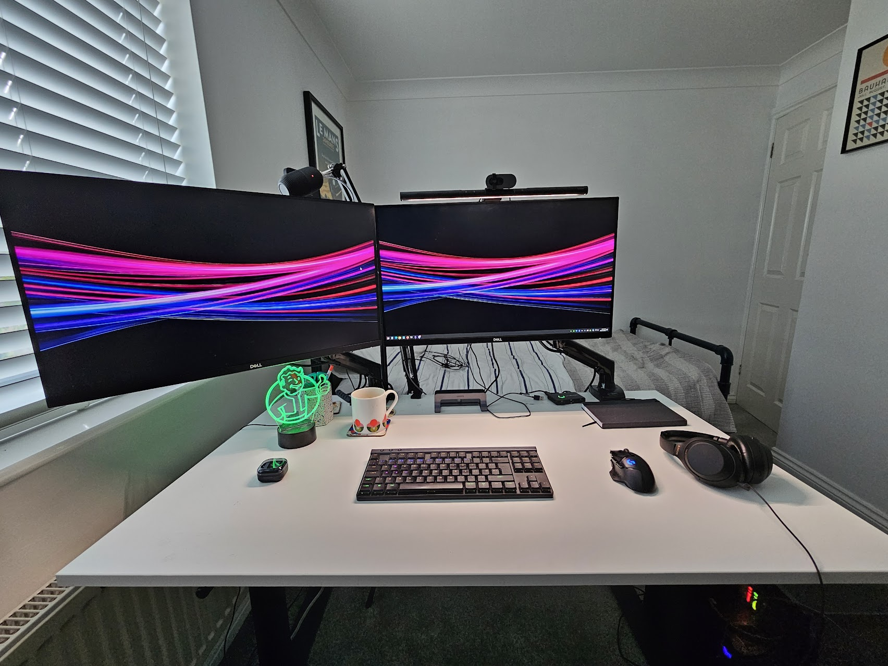
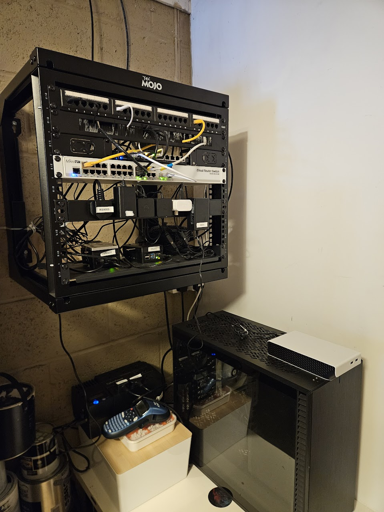

## Who are you and what do you do?

I’m Jamie, Lead Platform Engineer for the Toolstation/Travis Perkins group, where I look after our global GCP footprint.

My day-to-day is mostly about managing the high volume infrastructure that keeps the retail side of Toolstation moving in the UK, the Netherlands and Belgium. This is everything from the public facing websites (~5-10 million hits a day) to the heavy-lifting backend systems for stock and logistics. It's a containerised environment running on Kubernetes. I joined after the initial platform was built during the COVID rush, so my focus now is on moving us through a massive modernisation and optimisation phase to make it all more resilient and cost-effective.

I didn't start in DevOps/platform engineering, though. I’ve got a broad background including C# development, team leadership, and even IT training and support, plus a number of non-IT roles in the first part of my career. The "generalist" path has been a massive advantage as it means I’m not just looking at the infrastructure in a vacuum. I actually understand the developer experience and the CI/CD hurdles they face, plus I've got plenty of experience working in various industries.

When I’m not digging through K8s manifests, I'm usually obsessing over cars. I'm constantly on AutoTrader or Pistonheads looking for my next unnecessary purchase to replace the BMW M2 I sold a while back. I live in Northampton with my girlfriend and step-son, and usually spend my evenings trying to do the maths on a suitably unsuitable vehicle. I also love to cook - Italian food is my preference and I'd like to get an outdoor kitchen setup so I can BBQ all year round.

## What first got you into tech?

We had various computers when I was growing up, things like Spectrums then later Amstrad, 386/486, etc. I'd always try to work out how to play games on them, which wasn't always easy. I started building my own computers later on, again for playing games, but also messing around with code and stuff. I'd credit computer building for honing my troubleshooting skills. Having to fix things like IRQ settings without the internet to help you was not always easy! Later on, dial-up internet was so slow that you'd probably give up and [RTFM](https://en.wikipedia.org/wiki/RTFM) instead.

In terms of software I have always been into coding in one way or another. I remember writing scripts for the IRC client "mIRC" to do cool stuff. I realised that I liked making software my own. One minute you're just a user in a chat, and then with a few lines of script, you can automate responses, kick people, or even build entire tools inside the client. I realised that you don't always have to accept how software works out of the box.

I did used to enjoy web development but these days prefer backend or infrastructure. I remember making really bad websites in Geocities, then later would use Dreamweaver or similar to make slightly less bad websites about skateboarding, mountain biking, games, etc! This was before Javascript was common on the web, everything was just HTML/CSS.

I've always had a desktop computer of some description and made space for a proper desk wherever I have lived. I've also got some network equipment which I'll talk about later.

## What does your typical working day look like?

I start the day with the usual standups to talk about what's in the sprint and make sure we're on track. Because I’m in a small team with a very specific remit, I’m lucky enough to spend the vast majority of my day 'head-down' and task focused.

Most of my time is spent in the terminal or VS Code, working through the modernisation backlog, migrating workloads over to the new clusters or refining our GKE setup. I generally prefer to be left to it, making sure the platform is as stable and automated as possible.

Outside of task work I am also quite opinionated on our architecture and general direction. I spend time mentoring and helping the other platform engineer who brings a lot of experience on the infrastructure side, whilst I tend to be more up to speed on the developer side of the job.

I make a point of stepping away for lunch to cook something decent and clear my head with a walk. Once the day is done, I log off and completely disconnect. I am a strong believer in having a hard line between work and home, even though I often spend time at my desk in the evenings playing games or messing with my home network.

## What’s your setup? Software and hardware. Pictures welcomed!

The best part of my setup is my Herman Miller Embody chair. It cost over £1k, but I don't get back ache or shoulder pain anymore, so it's worth it! I have tried to improve the ergonomics of my setup as much as I can. We sit at our desks for hours on end and I think people overlook how important their chair/desk can be.

### Work

For work I have been given a Windows Laptop with some variant of the i7 CPU & 32GB RAM. Whilst it has Windows 11 on it, I mostly work within WSL2 running Ubuntu. I'd like to go full Linux or even Mac, but there are bureaucratic reasons stopping me.

I've got a mini-KVM to switch mouse/keyboard inputs between the work laptop and my own PC, plus a dock under the desk for power/HDMI connectivity. I use a Jabra wireless headset for meetings. Laptop goes in a mount just behind my monitors to keep it out of the way. Software is almost exclusively my terminal(s), VSCode and the GCP console.

### Home PC / Gaming rig

For home use.. I've got a gaming PC that runs Windows 11 and spends more time operating as a YouTube client or dev machine than a gaming PC.

- AMD 5700X3D with Arctic Freezer II AIO
- 32GB RAM
- ASUS 4070Ti Super
- ~6TB of storage across NVMEs and HDDs
- G502 wireless mouse, G515 TKL keyboard
- 2x 27" Dell S2721DGF 165hz monitors on single monitor arms. Connected using DisplayPort, freeing up the HDMI slots exclusively for my work laptop.
- Logitech Brio webcam
- BenQ lightbar
- Razer Siren microphone
- Sony WH-1000XM4 headphones
- Lian Li O11-D case with loads of fans that I want to replace with quieter ones
- Software: Steam, Firefox, vscode...

## What’s the last piece of work you feel proud of?

The new Kubernetes clusters at work, which are entirely IaC and support all the latest GCP/GKE features like Gateway API & Dataplane V2. Big improvement on the older setup and should be more cost effective and perform way better!

### Home network

At home, my network maybe deserves a mention because it's a bit OTT for a home setup! This is the current iteration that's been through many different configurations. I did used to have exclusively Ubiquiti equipment, but now have a mix of vendors.

- Mikrotik RB5009 router - Core routing, firewall, PPPoE WAN, DNS forwarding, DHCP
- Mikrotik CRS326 switch - VLAN switching and port management
- Unifi U6-Pro and U6-Lite APs
- 2x DNS servers (Raspberry Pi4's) - AdGuard Home and CoreDNS
- Cyberpower ~750w UPS

All housed in a wall-mounted 9U rack in my garage, with plenty of labels. I've terminated my cat6 cables to a patch panel and tried my best to make it look fairly tidy.

The infrastructure is defined as code using OpenTofu for network device configuration (firewall rules, VLANs, routing, NAT) and Ansible roles for service deployment/DNS - including certificate management and renewal, NUT for the UPS, Grafana dashboards for various metrics, 'homepage' dashboard, Traefik for routing, and an NTP server. Plus lots of other things that i've forgotten.

Everything that can be is defined in code. It's all stored in a private GitHub repo that has several pipelines including CI & end-to-end release management. I use the conventional commits standard to automatically generate changelogs and lint everything to production standards.

The whole setup is documented and can be quickly re-deployed anywhere with similar hardware in a few minutes. I have a UPS with automatic failover and even run my ONT (ISP box for fibre internet) via PoE so I can maintain internet access in a power cut situation, as long as the exchange is online.

Oh and I have an Unraid server with about 90TB of storage for all the blu-rays I've ripped and serve via Plex. The server is an Intel i5-10500T CPU, 32GB RAM, 9 3.5" enterprise HDDs of various capacities, 2 NVMEs (for cache purposes), housed in a Fractal Define7 XL case. I had to use a SAS card to expand the amount of HDDs I could install.

## What’s one thing about your profession you wish more people knew?

I wish people knew that Platform Engineering isn't just "DevOps with a new name". It's about building a product where the customers are your own developers.

I see Platform Engineering as the bridge between the cloud providers (like GCP or AWS) and the actual business. It’s about taking incredibly complex tools such as Kubernetes and turning them into a stable environment that doesn't fall over when 10 million people hit it.

Even if I'm not working directly with software developers every day, my job is to make sure that when they do push code, the infrastructure is solid. It’s less about "support" and more about building the foundation that prevents fires before they start.

## Share with others something worth checking out. Not necessarily tech related. Shameless plugs welcomed.

https://radio.garden/listen
