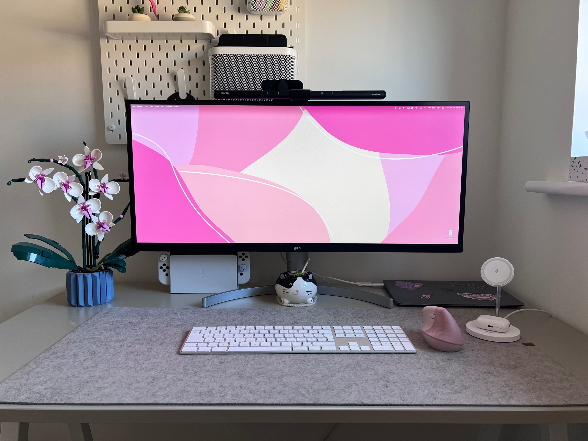

## Who are you and what do you do?

I'm Jana and I'm a UX/UI Designer. My background is in agencies, so I have experience designing for various industries, from email campaigns for football clubs to heavily regulated fintech mobile apps. I really enjoy web design though. I love blending creativity with strategy while adhering to UX principles, and sometimes breaking them too. I recently got into building Framer templates focusing on wellness brands.
Outside of work, I'm a pretty boring, introverted person but I love music, particularly metalcore and deathcore so naturally I enjoy going to concerts (just got back from Download Festival and seeing System of a Down next month), exploring new places, eating out, and strength training to stay fit for as long as possible.

## What first got you into tech?

I'm completely self-taught and only got into tech in 2022, after deciding to quit my job as a Fraud Analyst and pursue design which is something I'd leaned towards my whole life. It started when I was around 10, when I got my hands on a pirated version of Photoshop and started making graphics featuring celebrities and horses (I was very into horse riding back then!). That led to creating a blog to share those designs, which I customised with HTML and CSS and that's where I first came across coding.

Unfortunately, I didn't continue down that path. My parents pushed me in a different direction and I ended up studying nursing. I knew long before graduation that it wasn't for me, so I climbed the corporate ladder instead, eventually becoming a Fraud Analyst but design won in the end. My parents still don't quite get it and keep reminding me I should have been a nurse.

## What does your typical working day look like?

My days are currently quite all over the place with no real routine. I'm looking for a new role, so most of my time goes into job searching and tailoring applications. Despite being unemployed, I try to treat my days like I would normally do with a 9am start and 5pm finish but there is a possibility I may take a longer lunch because there is nobody who can tell me off.

## What's your setup? Software and hardware. Pictures welcomed!

Nothing spectacular, I'm afraid! I don't buy new tech unless something is broken or can't keep up with my work.

- MacBook Air M1
- Apple iPad Air 2020
- LG Ultrawide monitor (this was a gift, I have no idea what model)
- Logitech Lift vertical mouse
- Apple Magic Keyboard

### Software

- Framer
- Figma
- Affinity Suite

## What's the last piece of work you feel proud of?

Probably my first mobile app project.  A fintech product focused on family wealth, helping parents and relatives invest in a child's future. It's always rewarding to work on something with a genuinely positive outcome that people enjoy using. Despite being new to app design, I'm proud of how it turned out, even with the complexity of the flows involved.

## What's one thing about your profession you wish more people knew?

Most of our work is invisible. People see the final UI screens, but getting there involves a lot of research, strategy, conversations, systems thinking, and countless iterations. And even then, it's never truly finished and the cycle just repeats.

## Share with others something worth checking out. Not necessarily tech related. Shameless plugs welcomed.

- For any fitness enthusiasts tired of programming their own workouts,  I really love [the Ladder app](https://www.joinladder.com/)
- [Palia](https://palia.com/) - Free to play, open-world MMO game that I’ve been enjoying for a couple of years
