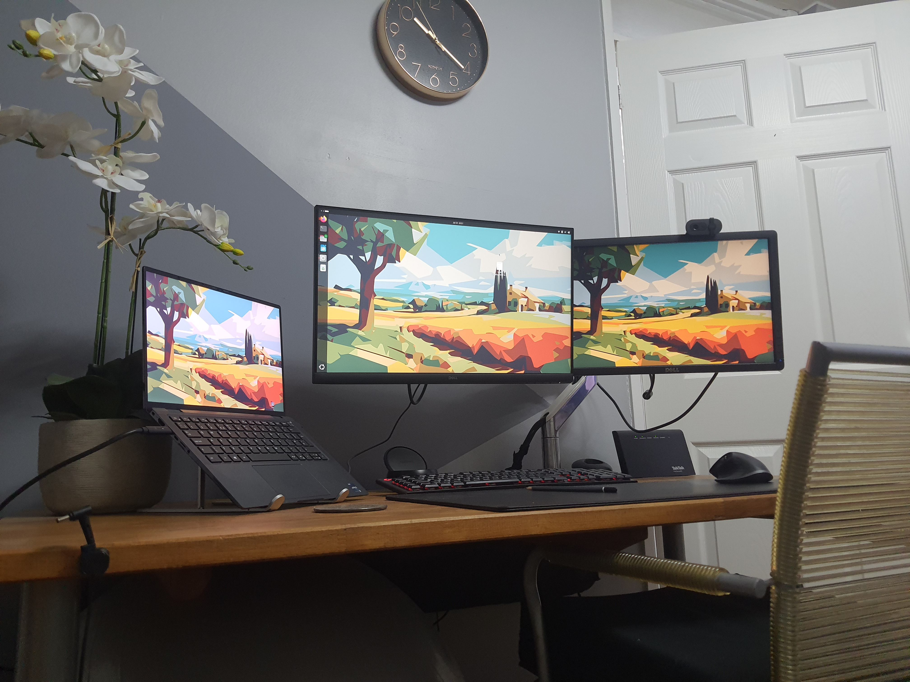

## Who are you and what do you do?

I'm the senior code wizard at Oxygen Finance, caretaker of BidStats - a magical land where mere mortals hunt for tenders in the public or private sector. (No dragons, but plenty of spreadsheets.)

## What first got you into tech?

Once upon a time, I was a care worker - saving the day, one cup of tea at a time. Then, along came COVID, and suddenly my job was both hazardous and still paid in peanuts. Tech started looking mighty attractive!

## What does your typical working day look like?

No two days are alike - sometimes I battle Python bugs, sometimes I wrestle with Azure, and other times I try to make peace with Mailgun, Stripe, or HubSpot. I juggle deployments, tame the wild agile board, and bravely face the Google Search Console. For fun, I spy on user behaviour in Clarity - don’t worry, I only watch the interesting clicks.

## What's your setup? Software and hardware. Pictures welcomed!

My setup is the stuff of legend: a trusty Dell laptop, a Logitech mouse and keyboard that have survived more snack crumbs than a bakery, and two extra screens for maximum multitasking (and minimum neck strain).

- Operating system: Ubuntu
- Favourite shell: [Oh my ZSH](https://ohmyz.sh/)

## What's the last piece of work you feel proud of?

I gave the BidStats front end a glow-up - think less t-shirt, jeans and sneakers and more “Devil wears Prada”, all while keeping our SEO happy and healthy.

## What's one thing about your profession you wish more people knew?

One of the highlights? Convincing the business that security fixes are just as exciting as shiny new features. (Spoiler: They’re not. But at the end of the day, this is what makes the business people sleep better)

## Share with others something worth checking out. Not necessarily tech related. Shameless plugs welcomed.

Three books that turbocharged my career (no caffeine required):

- "Continuous Delivery" by Jez Humble and David Farley
- "The Lean Startup" by Eric Ries
- "Accelerate" by Nicole Forsgren, Jez Humble and Gene Kim

My favourite Sci-fi book: "The Goodmakers" by Frank Herbert
