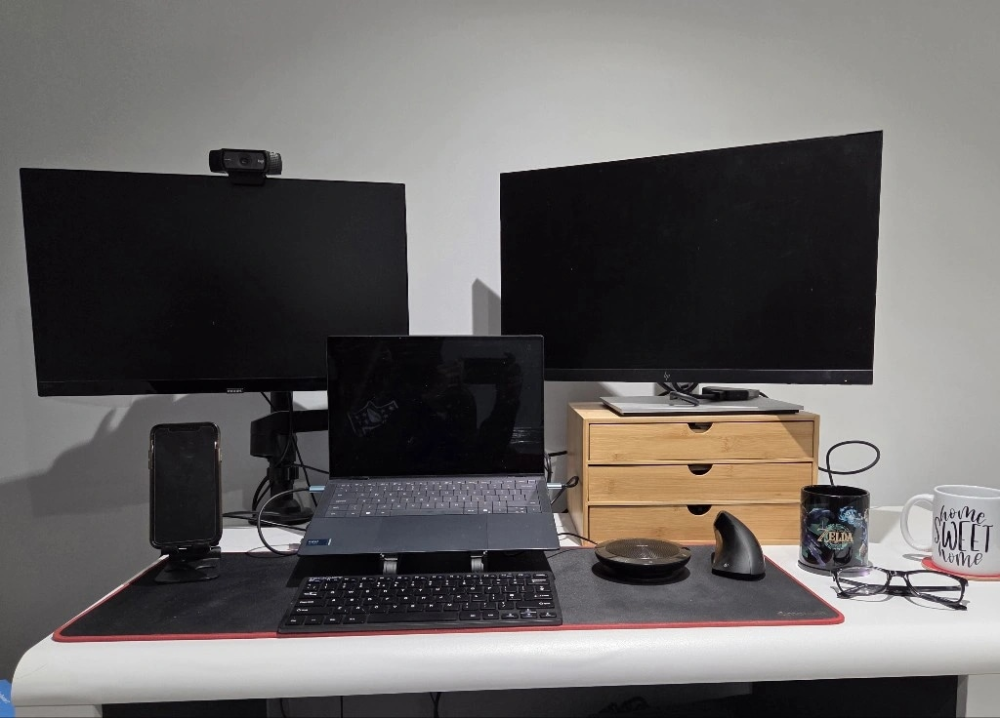

## Who are you and what do you do?

Hi I'm Kiran. I'm a Principal Product Manager. Over the last 7 years I've worked for a consultancy, Transform UK, where I've led product teams to improve and build great experiences for users across lots of different industries such as central Government, education, justice, utilities and media.

## What first got you into tech?

As with a lot of people - by accident. I started off as an Aerospace Engineer working in Defence....and then went into Management Consulting where I wore many hats such as delivery management, change management, business analysis before moving into product....and I've been here ever since.

## What does your typical working day look like?

The great thing about my work is that there is no 'typical day' but just to give you an overview of how yesterday looked...

- I negotiated with my toddler to go to nursery (I did bribe her with half a biscuit :o ...don't judge me)
- I logged on....we had our Daily Stand Up with my team to discuss blockers, updates and plans for the day.
- We happen to be recruiting at the moment so I did an interview
- ...then switched back into client mode where I spent the rest of the day trying to break a new app that we've built ahead of a go-live this week.

## What's your setup? Software and hardware. Pictures welcomed!

I need lots of screens....and probably better cable management....so again, please don't judge ;)

## What's the last piece of work you feel proud of?

For my utilities client I led a team which fundamentally changed the way Operational leaders engaged with their team on the subject of Health & Safety. We produced an app which saw an increase of 20%+ in engagement almost immediately and was rated 2pts higher in overall satisfaction. We were given an award from their CEO for our efforts.

## What's one thing about your profession you wish more people knew?

Beyond the jargon and acronyms, the concept is very simple. Deliver and maximise value to users. Repeat.

## Share with others something worth checking out. Not necessarily tech related. Shameless plugs welcomed.

Not one, but a few local things worth checking out...

- My favourite small concert venues: [The Black Prince](https://www.theblackprincenn.com/) and [MK11](https://www.mk11kilnfarm.com/).
- Local sports teams: [Northamptonshire County Cricket Club](https://nccc.co.uk/) and [Northampton Saints](https://www.northamptonsaints.co.uk/).
- Museums I visited recently: [Northampton Museums](https://www.northamptonmuseums.com/).
- Theatres worth checking out: [Castle Theatre](https://www.parkwoodtheatres.co.uk/castle-theatre) and [Royal & Derngate](https://royalandderngate.co.uk/).
- Run I completed a few weeks ago: [The Amazing Northampton Run](https://www.theamazingnorthamptonrun.co.uk/).
- My favourite YouTube channel at the moment is the [Tiny Desk Concerts](https://www.youtube.com/playlist?list=PL1B627337ED6F55F0).

...and that's all I can think of 🙂
