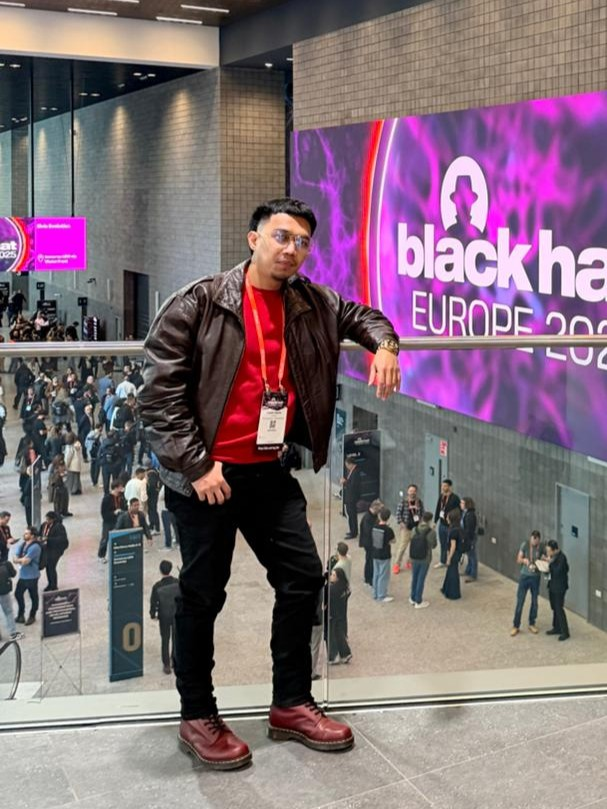
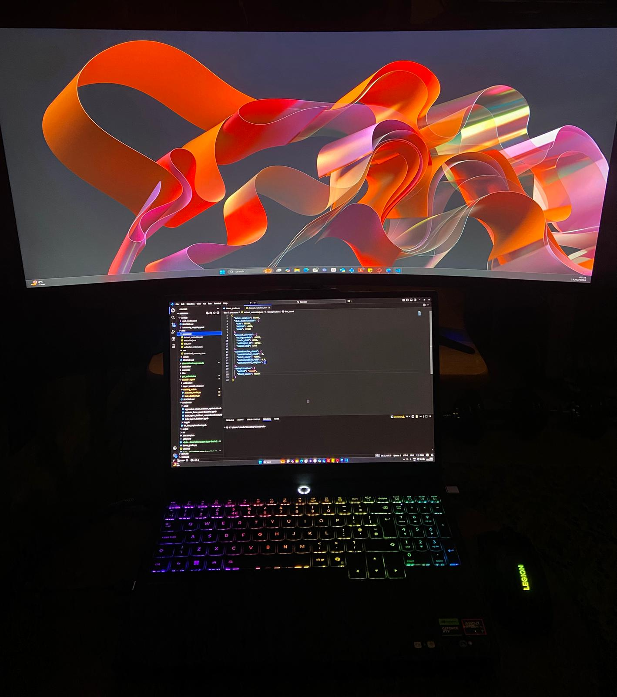

## Who are you and what do you do?

I'm Louie Opina, originally from the Philippines, and I'm currently a postgraduate student at the University of Northampton, specialising in Internet Technology and Security.

Before moving to the UK, I started ON eSports, a gaming internet café where we hosted competitive quarterly tournaments. We ended up closing during COVID, but that experience taught me a lot about leadership, operations, and bringing a community together.

After that, I joined Infinivan Inc., a Japanese ISP telecommunications company known for high-speed fibre connectivity. That's where I got hands-on exposure to large-scale network infrastructure and enterprise-grade internet systems and set up a server room.

I've also done freelance consulting along the way, helping local businesses move into the digital space securely.

These days, my main focus is AI and cybersecurity. I'm building intelligent tools, including a personal AI system I call "Grandson of Anton," with the long-term goal of shaping it into something like a personalised JARVIS: an AI that doesn't just generate responses, but reasons, orchestrates, and assists in meaningful ways.

## What first got you into tech?

Gaming, curiosity, and automation, honestly.

Growing up, I was really competitive and made some few money from it. I played MOBA (Multiplayer Online Battle Arena) games like Dota and many more, and picked up a few awards from school competitions 😆.

One moment that sticks with me is jailbreaking my first iPhone just to download apps for free, and then showing my friends how to do it so we could all play together. That curiosity about how things actually work under the hood never really went away.

Over time, I started building small automation scripts and building tools to speed up repetitive tasks in my daily life. That habit of wanting to optimise everything naturally led me to starting ON eSports after graduation. And here I am now still automating 😆.

Gaming made me competitive. Automation made me technical. Together, they pulled me into tech.

## What does your typical working day look like?

My day usually starts with coffee and university classes or research work.

Most of my structured time goes into checking my email and social media, then into my assignments or refining my dissertation.

I'm naturally nocturnal, so my most creative thinking happens at night. Once academic work is done, I shift into building mode: experimenting in my local environment, testing ideas, and coding improvements into Grandson of Anton until my brain runs out of energy.

To reset, I usually watch a movie or some clips, usually something related to tech.

## What’s your setup? Software and hardware. Pictures welcomed!

I use a Lenovo Legion 5 with a Ryzen 7 processor, 32GB RAM, an RTX GPU, and 1TB SSD, connected to a 34-inch ultrawide monitor.

On the software side, I mainly use:

- VS Code and Cursor
- VMware Workstation Pro, Ubuntu, and Proxmox
- Kali Linux for security testing
- n8n for workflow automation
- DigitalOcean VPS for deployment
- OpenClaw for AI experimentation

I like having both local and virtualised environments so I can experiment freely without breaking my main system.

## What’s the last piece of work you feel proud of?

My dissertation work, for sure. I'm researching a calibrated risk assessment for LLM content moderation.

Instead of treating prompts as simply "toxic" or "non-toxic," I'm arguing for a middle layer: a calibrated human-review mechanism for ambiguous cases. AI safety shouldn't just be binary.

Earlier in my first term, I built a mental health chatbot using RAG (Retrieval-Augmented Generation) and fine-tuned a lightweight DistilBERT model. That project really opened my eyes to how important guardrails are in AI systems.

I also want to give credit to my AI professor, Jordan Legg, who pushed me to think beyond performance metrics like speed and accuracy and focus more deeply on safety and governance.

## What’s one thing about your profession you wish more people knew?

The technology now isn't just about consuming tools. It's about building them for a greater purpose.

We live in a time where one person with curiosity and a laptop can create incredibly powerful systems. But it takes experimentation, failure, and persistence.

Stay curious. Build things. Break things. Learn from it. And enjoy the journey!

## Share with others something worth checking out. Not necessarily tech related. Shameless plugs welcomed.

OpenClaw is worth looking into, especially now that OpenAI acquired them; it's gaining serious attention in the AI tooling space. It's powerful for experimenting with models, automation, and token-efficient workflows.
