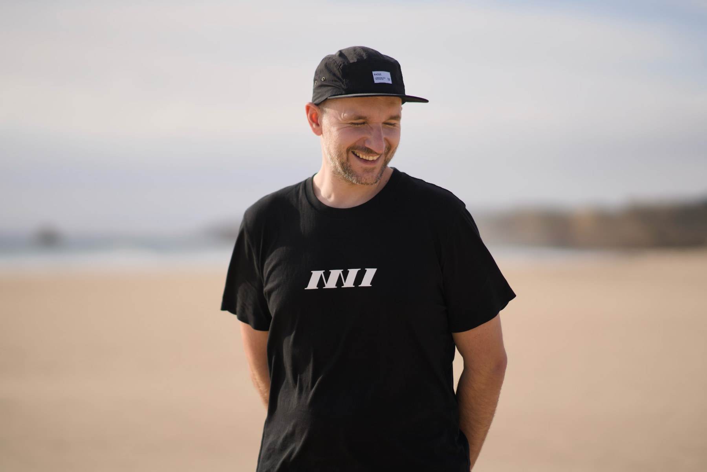
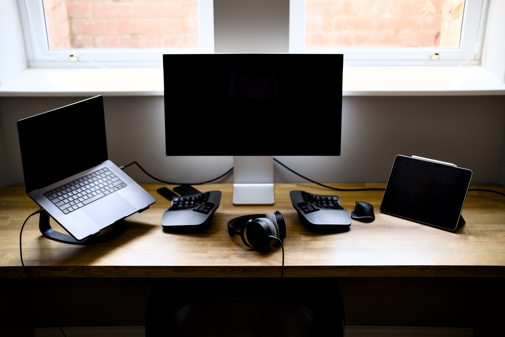
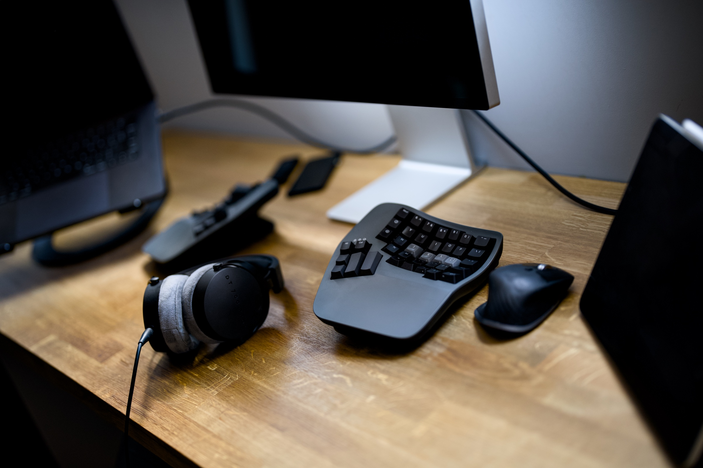

## Who are you and what do you do?

My name is Pawel Grzybek. I was born and raised in Szczecin in Poland, but for the past 14 years I have been in Northampton where I live with my wonderful wife and daughter.

I've been building software professionally for the past 15 years. The trendy job title for what I do is Full Stack Developer, but I'm not trendy and I like to call myself a Web Developer. I build websites! I use HTML, CSS and JavaScript on the frontend and Go and Node.js on the backend. I'm not religiously attached to any framework and try to use the best tool for the job. I know the core of the programming languages that I use and web standards well enough, so switching between abstractions built on top of them comes with ease.

Other than being a husband, father and developer, I'm a proud organiser of [NN1 Dev Club](https://nn1.dev), keen [blogger](https://pawelgrzybek.com/), open source contributor, a shit photographer and most of my spare money I spend on [hip-hop records](https://pawelgrzybek.com/music).

## What first got you into tech?

I've been into photography since I was 15. I learnt the composition, the balance between film sensitivity to light, aperture and shutter speed using the cheap Russian tank, [Zenit 12XP](https://sovietcameras.org/zenit-12xp/). A few years later I got my first digital camera, and naturally I wanted to present my photos to everyone. The web was the perfect place for it, so I taught myself how to build a simple static website. I also enjoyed messing around with MySpace themes.

Not long after that I realised that I enjoyed building websites a lot more than taking photos or shifting pixels around in Photoshop or Fireworks (what a cool software that was). I'm glad that something that I was truly passionate about back then transitioned into my profession, and two decades later I'm still loving it.

## What does your typical working day look like?

Every day I wake up around 4-5am, to kick my day off with a half an hour session of stretching and light exercises (abs, push-ups and squats). Nothing hardcore but every day. Coffee and podcast or audiobook are a perfect companion for my morning routine. I'm the most productive in the morning, so following that I zone out, get into the deep focus working state and try to accomplish as much work as possible. This state lasts until my lovely little human being wakes up.

Around 8am the whole family gathers in the kitchen, we listen to music, cook, dance, drink coffee and eat breakfast. Yes, we dance every day in the kitchen! Following that my girls either go to work/nursery or their weekly adventures, and I continue working until my brain allows me to stay productive.

Evenings are for family. We go for a walk, cook, chat, listen to more music, play, read books and things like that. We almost always do everything together. We don't have a TV, because we don't want to waste time in front of a TV.

I'm usually in bed sleeping like a baby by 10pm. My weekend routine is very similar to the work day routine, but the work time is spent with my family ❣️

## What's your setup? Software and hardware. Pictures welcomed!

In the typical [indie web](https://indieweb.org/) fashion, on my personal website I have a number of [slash pages](https://slashpages.net/). One of them is ["uses"](https://pawelgrzybek.com/uses) and it is a detailed list of hardware and software I use. Here you are, copy/pasta 🍝

### Hardware

- [Apple MacBook Air M4 13-inch](https://www.apple.com/uk/macbook-air/) (work)
- [Apple MacBook Pro M2 14-inch](https://www.apple.com/uk/macbook-pro/) (personal)
- [Apple iPad Pro 12.9-inch (5th generation)](https://www.apple.com/uk/ipad-pro/)
- [Apple iPhone 15 Pro Max](https://www.apple.com/uk/iphone-16-pro/)
- [Apple Watch Ultra Series 3](https://www.apple.com/uk/apple-watch-ultra-3/)
- [Apple AirPods Pro 2](https://www.apple.com/uk/airpods-pro/)
- [Apple AirPods Max 2](https://www.apple.com/uk/airpods-max/)
- [Logitech MX Master 4 for Mac](https://www.logitech.com/en-gb/shop/p/mx-master-4-mac.910-007577)
- [Kinesis Advantage 360 keyboard](https://kinesis-ergo.com/keyboards/advantage360/)

### Software

[I like defaults](https://pawelgrzybek.com/my-defaults-2026/) a lot, but besides that, I use some software that does not come pre-installed. Here is a list of the ones that I use most frequently.

- RSS reader: [NetNewsWire](https://netnewswire.com)
- Launcher: [Raycast](https://www.raycast.com/)
- Terminal client: [Ghostty](https://ghostty.org/)
- Text editor: [Neovim](https://neovim.io/)

### Photography

- [Sony α7R III](https://www.sony.co.uk/electronics/interchangeable-lens-cameras/ilce-7rm3) (body)
- [Sony FE 85mm F1.4 GM](https://www.sony.co.uk/store/product/sel85f14gm.syx/FE-85mm-F1-4-GM) (lens)
- [Sony FE 50mm F1.2 GM](https://www.sony.co.uk/lenses/products/sel50f12gm?sku=sel50f12gm.syx) (lens)
- [Sony FE 24mm F1.4 GM](https://www.sony.co.uk/store/product/sel24f14gm.syx/FE-24mm-F1-4-GM) (lens)
- [Hasselblad 500C](https://www.hasselblad.com/about/history/500-series/) (body)
- Zeiss Planar 80mm f/2.8 C (lens)
- Nikon FM2 (body)
- Nikon 35mm f/2 (lens)

## What's the last piece of work you feel proud of?

[NN1 Dev Club](https://nn1.dev/).

## What's one thing about your profession you wish more people knew?

I have a little advice not only for folks working in my profession but in general, for our generation. Deep focus and patience is not people's domain and folks keep on finding shortcuts. The average attention span for a given task is as long as the Instagram short. People spend a lot of time crafting a perfect automation striving for optimum efficiency, just to wake up the next day to improve their already obsolete automation. But...

> You'd be surprised how much you will do in a day, if you just sit and do it.

This is a lesson I learnt from alligator rancher Bill Tregle from Louisiana. I would love to visit him one day and thank him for this advice.

<iframe  src="https://www.youtube.com/embed/UgaqXr0G19Q?si=oNQ2VjsuR7-Ck4-P&amp;start=70" title="YouTube video player" frameborder="0" allow="accelerometer; autoplay; clipboard-write; encrypted-media; gyroscope; picture-in-picture; web-share" referrerpolicy="strict-origin-when-cross-origin" allowfullscreen></iframe>

## Share with others something worth checking out. Not necessarily tech related. Shameless plugs welcomed.

1. [Salt of the Earth - Natural Deodorant Crystal Classic](https://amzn.eu/d/0e4QZaZ8) - I tested every deodorant on this planet, but nothing beats this brick of salt!
2. [Yellow Bourbon Coffee](https://www.yellowbourbon.co.uk/) - not only local, but really incredible coffee
3. [WOLFBOX MF100 Compressed Air Duster](https://amzn.eu/d/00oDNeIG) - I also thought that I didn't need an air blower, but now I have it and I use it all the time
4. [Magnatiles](https://magnatiles.com/) - If you have young kids, this is a tonnes of fun (not only for kids)
5. [New Balance Series 990](https://www.newbalance.co.uk/men/shop-by-model/990/) - The most comfortable kicks money can buy
6. RSS
