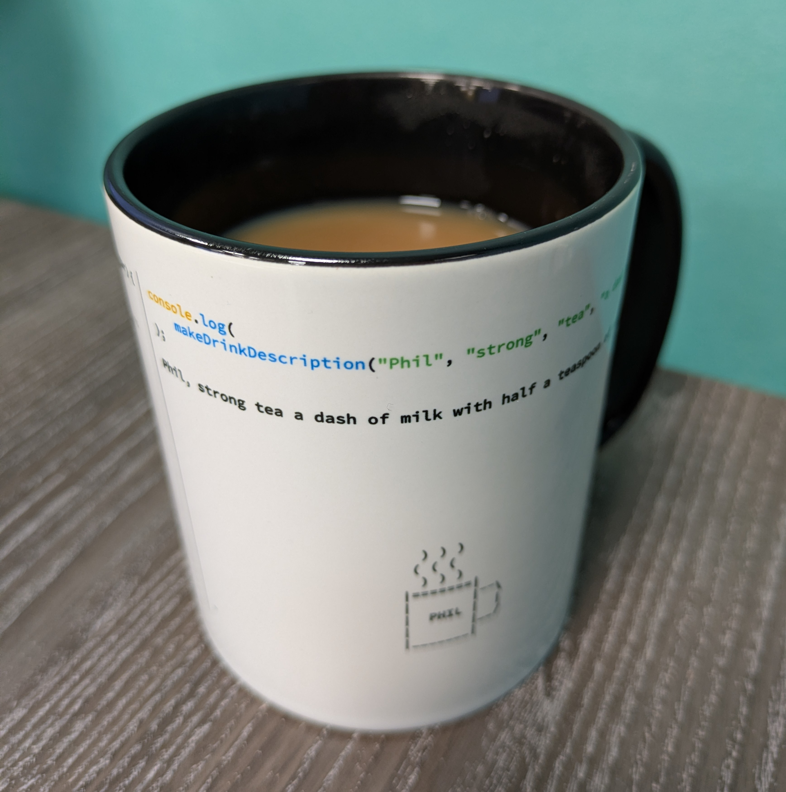

## Who are you and what do you do?

I'm a NN1 born Northamptonian and currently working for a US company who's the worlds largest developer & provider of management information systems (MIS) for the print industry. I'm on the UK team of a newly released cloud based MIS system called 'Nubium' (Latin for moon cloud) which has an API (Application Programming Interface) first approach making it much easier to integrate with other applications such as accounting, e-commerce, Zapier (application integration & automation platform) etc.

## What first got you into tech?

There are a few key points in my life, but it's a timeline of what shaped my tech background.

1. As soon as I laid hands on a computer. Thinking back, I didn't class it as programming as people perceive it now, but I programmed BASIC on a ZX Spectrum to make geometric patterns when around 8 years old.

2. In secondary school my maths teacher introduced me how to pirate software, I think he saw my talent and thirst for creative use of computers. So I made copies of my school's Microsoft products.

3. When I started skateboarding at the age of 12/13, I used to steal my stepdad's video camera to make skate videos of us, then put it back without him noticing. Myself and my best friend edited the videos using the schools equipment in break & lunch times.

4. At Northampton College they had a computer to edit video on, no longer VHS analogue! And I had access to better cameras & audio recording equipment. I bought a high-spec PC laptop off-the-back-of-a-lorry in Northampton, started to pirate video graphic, Photoshop & design software etc off the internet and created 3D computer animations, video & design. I was then introduced to a local crew who used to VJ (like DJing but with video & computer equipment) at some of England's largest hard dance music events & festivals. Mixing my video/animation work live to thousands of people at events & festivals was very satisfying.

5. Went to university at the Kent Institute of Art & Design, their video editing technology suite was crap compared to my standards, I had a better setup. I made friends with the guys who owned the local independent computer shop, so I spent more time at the computer workshop learning loads compared to being at uni.

In a nutshell, do what you love doing and are good at, and you just fall into your career.

## What does your typical working day look like?

I'm supposed to work from home, but it sends me insane. I feel that it's really unhealthy, especially for the mind. I only work from home if I'm ill. So I've got a few regular places I work from... I rent a desk space for a very reasonable rate, I'm an associate member of the University of Northampton, which is a great modern study environment. Recently, since meeting the crew from NN1 Dev, the [Vulcan Works](https://vulcanworks.co.uk) creative workspace in Northampton's cultural quarter kindly offer NN1 Dev the co-working space once a month for free so people who also work from home can actually be around other people! The [Vulcan Works](https://vulcanworks.co.uk) is a cool venue, big up to the management for their support of NN1 Dev.

Some people think I'm nuts for commuting to work when I don't have to. But I get up at 6am, leave around 7 to get the bus into Northampton. This gives me a chance to catch up on tech news and what's going on in the wider world, do my days work, commute back home via the town centre where I have a chance to catch up on print industry news. Yeah I could save loads of money not paying for travel and eating out every day, but it's a price worth paying for sanity.

## What’s your setup? Software and hardware. Pictures welcomed!

These days I don't have complicated hardware setups.

Day job hardware: Dell PC laptop.

Day job software apps: WalkMe, Inkscape, GNU Image Manipulation Progran (GIMP), Visual Studio Code, Notepad, Office apps, Jira, Salesforce, Enfocus Switch, Postman, Zapier.

Day job language model (LLM not Ai): Copilot (Mickysoft flavour of ChatGPT).

Home: MacOS & Ubuntu Linux. NordVPN, FOSS (Free & Open-Source Software), Transmission BitTorrent, Plex.

Home language models: Most of the usual suspects. Each model has its strengths & weaknesses for whatever purpose you're using it.

## What’s the last piece of work you feel proud of?

My previous job at a Northampton based large format printers - [Studio One Media Centre](https://studio1.org.uk). They invested in a MIS system, from who I now work for, and nothing was done with it for 2 1/2 years. So I tore up everything and started from scratch. The business is way leaner now in calculation of costs compared to the system they had before. There's also integrated e-commerce into the system and automation where possible.

## What’s one thing about your profession you wish more people knew?

Working in print is not as simple as pressing the go button on a photocopier. The print industry is very tech in many areas such as advanced machine operation, artwork design, brand management, multi-channel marketing, web development & design, product development, systems development... This list just goes on.

## Share with others something worth checking out. Not necessarily tech related. Shameless plugs welcomed.

Apologies, it's tech related! [The Register tech news](https://www.theregister.com) apart from being a great source of tech news, the reader comments on articles tend to be hilarious.
