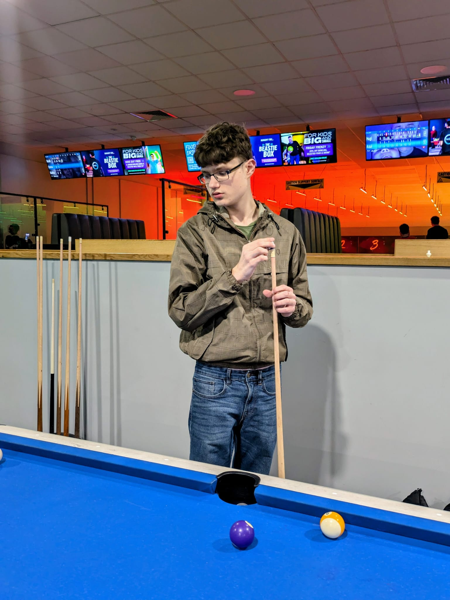

## Who are you and what do you do?

I'm Preston Arnold, a 16-year-old developer living in Duston, Northampton. I've been building on the web for six years now. 

Currently, I work as a freelance developer, taking on client projects, also working on my own side projects that solve problems I encounter. I'm structured about how I work (clear communication, reliable delivery), and I'm always open to teaming up with the right people to start something real.

## What first got you into tech?

As I was born in 2009, technology has always been a part of my life. Since I can remember, I've been fascinated by how tech works under the hood. It started in Primary School when I was taught Scratch, and I've been hooked on this form of expression ever since.

At around 10 years old, my parents got me a course on modern HTML, CSS & JS development. Once I started to experiment on my Raspberry Pi, this is when I truly fell in love with building things.

## What does your typical working day look like?

My typical day is a mix of problem-solving, building, home education and collaboration. I usually do my deepest work in the morning, then take a break for home education, and then focus on getting my agenda completed for the day.

Every day is different, which keeps things interesting.

I'm at Vulcan Works quite often. Being around other builders is such a great motivator for me, and it leads to conversations that you just don't get working alone.

## What’s your setup? Software and hardware. Pictures welcomed!

**Hardware**
- Dell XPS 13 9310 Laptop (massive thanks to [Eric Bye](https://www.linkedin.com/in/ericqbye) & [Paweł](https://pawelgrzybek.com/) ❤️)
- Dell Optiplex 3036 server for hosting and experimentation.

**Sofware**
- VS Code
- Obsidian (notes)
- Insomnia (API)
- Trello (project management)
- Claude (coding) - Deepseek (reasoning)

## What’s the last piece of work you feel proud of?

By far the work I feel most proud of is the TikTok Shop creator affiliate bot. I saw the potential early: in-app commerce + affiliates on the biggest short-form video platform. So I built an automated tool to handle personalised outreach and follow-ups. I pitched this to a teen millionaire from the US with connections at TikTok, and within several months, we were handling over 100 brands.

I was eventually pushed out of that business, but I gained so much from it. It taught me how to build at scale, how to partner with others, and what I need in a team to do work I'm proud of. Those lessons are exactly what I'm applying to my freelance work and projects now.

## What’s one thing about your profession you wish more people knew?

Age does not matter. What matters is resilience.

Programming is trial and error. You will break things. You will hit walls. You will feel like you don't belong. But the people who make it aren't the ones who got it right the first time. They're the ones who kept going when nothing worked.

The real difference between someone who builds and someone who dreams about building is simple: they started. They failed. They kept going.

If you're hungry enough to learn, if you're willing to sit with a problem until it makes sense, if you can look at an error message as a clue rather than a stop sign, you can do this. No degree required. Just curiosity.

Stop worrying about whether you're ready. Just build.

## Share with others something worth checking out. Not necessarily tech related. Shameless plugs welcomed.

Give "Surely You're Joking, Mr. Feynman!" by Richard Feynman a read, one of the best books I've ever read. It's very inspiring and made me realise that curiosity and experimentation are what drive innovation.

If you're building something interesting, come say hi at a nn1.dev event ([or contact me](https://prestonarnold.uk/contact/)). I'm looking to commit to something.