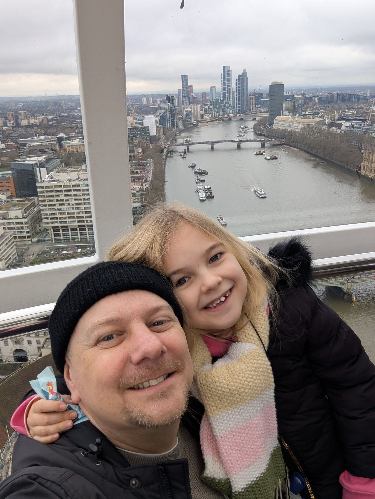
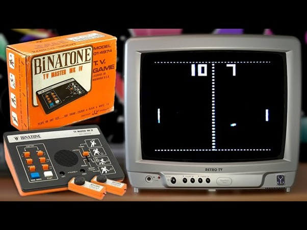
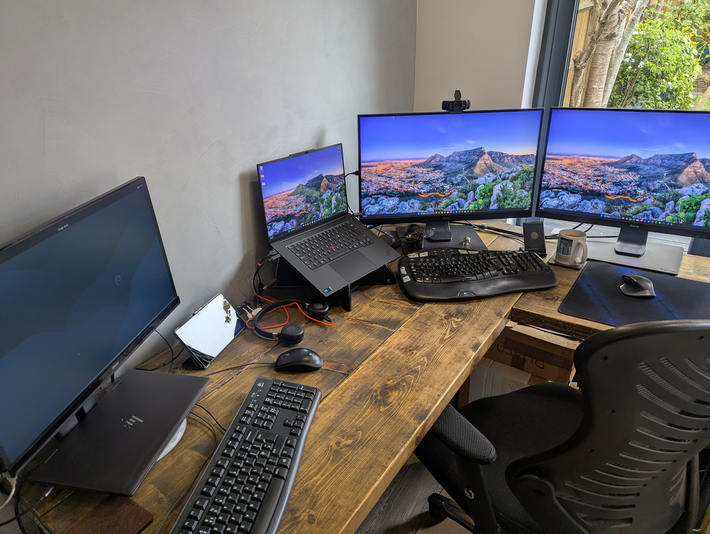

## Who are you and what do you do?

I'm Richard, founder of Safehold Solutions. I was born in Northampton and never managed to leave. After school I studied for an HND in Computing at Nene (Park Campus, now a housing estate) before getting my first job in tech support at Pegasus Software in Kettering.

I spent over 20 years in health tech, mostly running software development teams but also involved in all aspects of IT from support through infra and cyber security/info sec. Last year I left my job and set up Safehold Solutions, and I'm currently focused on creating a supplier risk management solution aimed at NHS customers.

Outside of work I'm married with a young daughter and 2 ageing cats. I like to travel, collect Lego, and throw darts (this is where I do my best thinking).

## What first got you into tech?

I remember playing on our first Binatone games console at a young age. It switched between 3 or 4 black and white games like tennis and had a (wired) box shaped controller with just a wheel for controlling the action. It couldn’t be any more basic but it was great fun!

Growing up we went through a few generations of home computers including the Toshiba HX10 (MSX), Oric 1, Spectrum +2, Atari ST and eventually my first PC around the mid 90s. I spent many hours in those early days on the MSX and the Oric 1 manually entering game code which used to come printed in magazines. I didn't understand any of it, and it often didn’t run on first attempt, but I persevered. Eventually I started writing code in QBasic on the school PC’s and started to make sense of what was going on. I guess that was when I really got more into the tech! I mostly developed simple games including a version of the old Star Wars arcade machine trench run.

## What does your typical working day look like?

I'm usually up between 6/7am and try a squeeze in a quiet coffee and catch up on some reading / research before my wife and daughter get up. It’s then a case of making sure they get out of the door fed and watered before hitting my desk at 8:30/9am.
Starting a business means I'm having to cover a lot of bases, but I'm still spending most of my day developing our core product for now. I also spend time creating automations and smaller project aimed at helping my day to day (AI driven marketing for example), or just for exploring new ideas and tech.

I try and schedule some time each week to dedicated learning and am working towards CompTIA Security+.

I tend to finish 6pm latest to spend time with the family, sometimes returning to work once my daughter is in bed.

## What's your setup? Software and hardware. Pictures welcomed!

I spend most of my time in the VS Code editor with Claude Code as my assistant, or Bolt which I’m using primarily for front end work.

### Primary hardware

- 16" Lenovo ThinkPad P1 (Windows)
- 2 × Iiyama 27" 4k displays
- Fujitsu Primergy TX1310 Xeon E3 server (Debian and Docker Desktop)
- Logitech K350 keyboard
- Logitech MX Master 2s mouse
- Jabra wireless headset

### Primary software/tooling

- VS Code
- Docker Desktop
- Claude
- ChatGPT
- Bolt
- Replit
- N8N
- MySQL
- React
- Python
- MS Office
- Notepad++
- Jira
- Confluence

## What's the last piece of work you feel proud of?

I'm really proud of the Cognition platform I'm currently building. I've been in more hands off, leadership roles for many years prior to setting up Safehold Solutions, so getting back deep into the code has been fun. Building a business from scratch is incredibly challenging, but it’s also exciting and rewarding.

## What's one thing about your profession you wish more people knew?

Probably the scope and rate of change. I don't think people fully appreciate how many different areas of IT there are to specialise in, or just how quickly the landscape changes. It can be a real challenge to keep your knowledge up to date, especially now in the age of AI (and in my old age!)!

## Share with others something worth checking out. Not necessarily tech related. Shameless plugs welcomed.

[NetworkChuck](https://www.youtube.com/@NetworkChuck) on YouTube – Marmite, but his content definitely got me interested in tech I hadn’t used before.

I also watch a fair amount of motivational business start-up content like [My First Million](https://www.youtube.com/@MyFirstMillionPod) and [Starter Story](https://www.youtube.com/@starterstory).
