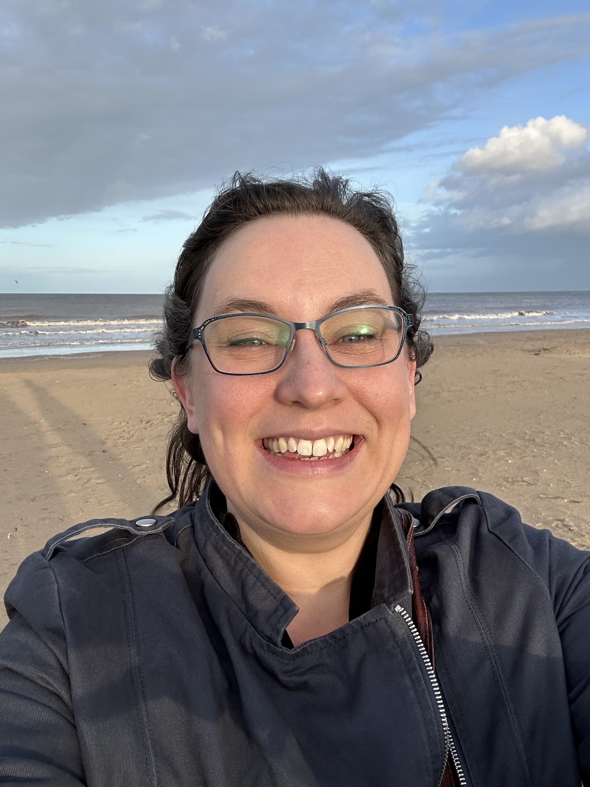
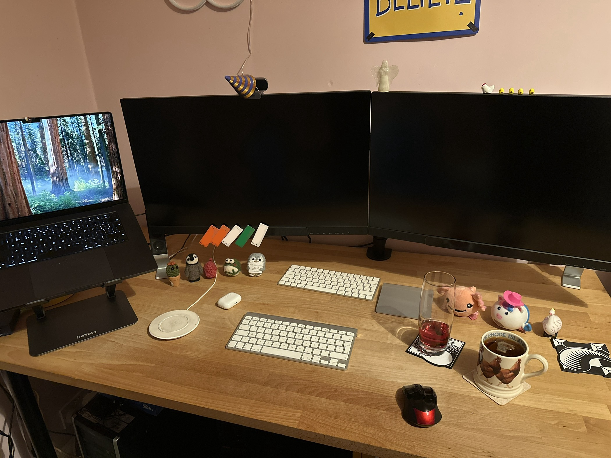

## Who are you and what do you do?

I’m Rosie, officially a senior fullstack developer but always much happier doing backend stuff. I’ve mostly worked with PHP with a dash of javascript/Vue.js. I currently work for an EV charging company and I’m involved in trying to make sure that charging works, and that charging data flows between chargers/servers/apps/3rd parties, with varying results - it’s still a fairly young industry and every day brings new and exciting surprises. Luckily I love bug hunting. 

Outside of work I love doing crafts (anything from crochet to stained glass to building tiny AT-ATs), boardgames, reading (particularly fantasy), running, and all kinds of food - I'm slightly addicted to sushi.

## What first got you into tech?

My dad and my older sister - my dad studied electrical engineering and has always been very interested in tech, and has a better home setup than I do now! We had access to computers from 1996ish (Prince of Persia on a monochrome laptop was accidental hard mode) and our own PC and dialup in 1997. My sister and I had to use pocket money to go towards the ever increasing phone bill and got in trouble a lot for hogging the phone line! I remember creating an amazing and horrific geocities website by dragging links and pictures around on the page very haphazardly - positioning was done by endless tiny transparent images. It was beautiful. I've also always loved puzzles and we played hours and hours of Tetris as kids, which means I'm now *really* good at packing way too much stuff into small spaces.

Then when my sister went on to study Computer Science it seemed really cool and I wanted to be just like her, so I ended up studying it as well, but as a bonus did dual honours with Psychology which was a nice contrast/compliment. 

After studying I got an unrelated job, decided I didn't like that, went back to Uni and spent longer than planned to almost get a master's in CS, did a brief internship, then got a job as a Technologist for a small independent publisher, and on the whole loved it. 

## What does your typical working day look like?

Either I’ll get up 6ish and do sensible things like exercise/things I have to do like go into the office, or I’ll roll out of bed after 9 and head straight to my home office for my first meeting at 9:30. My days generally contain a fair few meetings, where I try and explain the legacy system I work on, or the ins and outs of charging and how the data feeds out, and try and plan how to make all of it work better. I do some of the organisation of what tickets the team should pick up and make sure the planned work covers everything needed. Sometimes I actually manage to code too. 

Lunch is usually at my desk or perhaps I’ll have a wander, and evenings are often in a pub or at a club (books and drawing, not Out Out), going to see friends, at the theatre, or (slowly) renovating my house.

## What's your setup? Software and hardware. Pictures welcomed!

- Work 16" M3 MacBook Pro
- Two shiny Iiyama 27" ProLite monitors
- Various Apple keyboards and trackpads
- Personal Windows PC I acquired a while back, the most I can say of it is that it works!

## What's the last piece of work you feel proud of?

Some automation work I did with close collaboration with multiple colleagues and teams at work - it wasn't initially prioritised by the business but we found a way to make it work, and it helped reduce some manual processes down from months to days as well as reducing the risk of errors, and has been really useful for several other situations since. Very satisfying.

## What's one thing about your profession you wish more people knew?

How creative it can be, and also that you don't necessarily need to be good at maths to do well in it, and the work is often fun problem solving. I think I probably found learning Latin at school more useful for coding, as it takes a lot of logic for translation.

## Share with others something worth checking out. Not necessarily tech related. Shameless plugs welcomed.

- [https://www.askamanager.org/](https://www.askamanager.org/) - I shared this in discord previously but it's worth sharing again - like an agony aunt for workplace issues. Some of it is bonkers, and can either make you feel better about your job or realise that perhaps your place of work might be slightly toxic, but I've found so much useful stuff in there amongst the entertainment.
 - [https://thebloggess.com/](https://thebloggess.com/) - a lovely blogger called Jenny Lawson, who has multiple books too. She mixes dark humour with very honest accounts of mental illness, and is just generally a delight.

